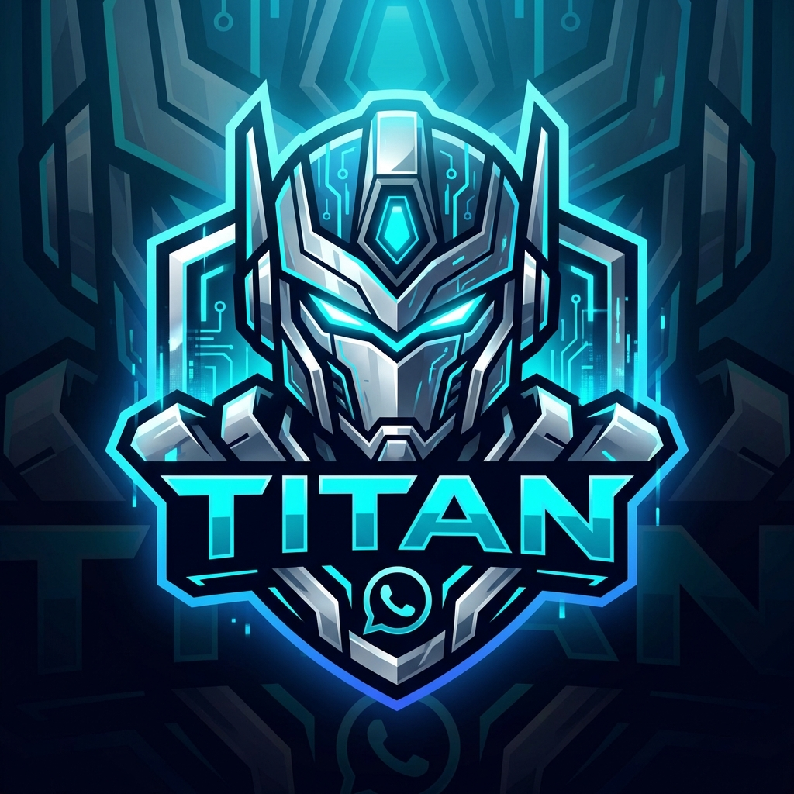

# 🤖 TITAN WhatsApp Bot

A powerful, private WhatsApp bot built with [@whiskeysockets/baileys](https://github.com/WhiskeySockets/Baileys). Designed for deployment on Render.com's free tier.



## ✨ Features

### 🔐 Privacy & Security
- **Owner-only**: Bot only responds to your phone number
- **Connected Groups**: Enable/disable bot per group
- **No read receipts** for ignored messages
- **Pairing Code authentication** (no QR code needed)

### 👥 Group Management
- `tagall` - Mention all group members
- `kick`, `ban`, `mute` - Moderation tools
- `promote`, `demote` - Admin management
- `add` - Add members by number
- `link` - Get group invite link
- `muteall/unmuteall` - Restrict messaging

### 🛡️ Anti-Features
- **Anti-Link**: Auto-delete links, warn/kick violators
- **Anti-Spam**: Rate limiting, flood detection
- **Anti-ViewOnce**: Auto-save view-once media
- **Anti-Delete**: Log deleted messages

### 👋 Welcome/Goodbye
- Custom welcome messages for new members
- Goodbye messages when members leave
- Placeholders: `{user}`, `{group}`, `{time}`

### 🎨 Media Tools
- `sticker` - Convert image/video to sticker
- `toimg` - Convert sticker to image
- `vv` - Save view-once messages

### ⚙️ Settings
- Customizable prefix (global & per-group)
- Mode switching (private/groups/self)
- Quick replies system
- Backup & restore functionality

### 💫 Presence
- Show online/typing/recording status

## 🚀 Quick Start

### Prerequisites
- Node.js 18+ installed
- WhatsApp account (use a secondary number!)
- Git installed

### Local Installation

```bash
# Clone or create project
git clone https://github.com/YOUR_USERNAME/titan-whatsapp-bot.git
cd titan-whatsapp-bot

# Install dependencies
npm install

# Configure environment
copy .env.example .env
# Edit .env and set your OWNER_NUMBER

# Start bot
npm start
```

### First Run
1. Start the bot with `npm start`
2. Wait for the **PAIRING CODE** to appear in console
3. Open WhatsApp → Settings → Linked Devices
4. Tap "Link a Device" → "Link with phone number"
5. Enter the pairing code
6. Bot is now connected! 🎉

## 📱 Commands

| Command | Description |
|---------|-------------|
| `.menu` | Show all commands |
| `.status` | Bot status & uptime |
| `.ping` | Check latency |
| `.connectgroup` | Enable bot in group |
| `.disconnectgroup` | Disable bot in group |
| `.tagall [msg]` | Mention everyone |
| `.kick @user` | Kick user |
| `.ban @user` | Ban user |
| `.mute @user [min]` | Mute user |
| `.promote @user` | Make admin |
| `.demote @user` | Remove admin |
| `.add [number]` | Add to group |
| `.link` | Get invite link |
| `.antilink on/off` | Toggle anti-link |
| `.antispam on/off` | Toggle anti-spam |
| `.antivv on/off` | Toggle anti-viewonce |
| `.welcome on/off/set` | Configure welcome |
| `.goodbye on/off/set` | Configure goodbye |
| `.sticker` | Create sticker |
| `.toimg` | Sticker to image |
| `.vv` | Save view-once |
| `.setprefix [new]` | Change prefix |
| `.mode [type]` | Set bot mode |
| `.setreply [k] [v]` | Quick reply |
| `.backup` | Export settings |
| `.restore` | Import settings |

## ⚙️ Configuration

### Environment Variables

| Variable | Description | Default |
|----------|-------------|---------|
| `OWNER_NUMBER` | Your WhatsApp number (international format without +) | Required |
| `PORT` | Web server port | 3000 |
| `PREFIX` | Command prefix | `.` |
| `MODE` | Bot mode: private/groups/self | private |
| `BOT_NAME` | Bot display name | TITAN |

### Modes
- **private**: Only responds to owner (in private and groups)
- **groups**: Only responds in connected groups (owner commands only)
- **self**: Bot is silent (maintenance mode)

## 📁 Project Structure

```
titan-whatsapp-bot/
├── index.js          # Main bot code
├── package.json      # Dependencies
├── titan_logo.png    # Bot logo
├── .env.example      # Environment template
├── .gitignore        # Git ignore rules
├── auth_info/        # Session data (auto-created)
├── data/             # JSON storage (auto-created)
│   ├── settings.json
│   ├── groups.json
│   ├── users.json
│   └── quickreplies.json
└── downloads/        # Downloaded media (auto-created)
```

## ⚠️ Important Warnings

### Unofficial API
This bot uses an **unofficial WhatsApp API**. Be aware:
- ⚠️ Risk of account ban (use a secondary number)
- ⚠️ May break when WhatsApp updates
- ⚠️ Not affiliated with WhatsApp Inc.

### Best Practices
- ✅ Use a dedicated phone number
- ✅ Don't spam or bulk message
- ✅ Respect WhatsApp Terms of Service
- ✅ Keep the bot private/personal
- ❌ Don't use for commercial spamming
- ❌ Don't share your auth_info folder

## 🔧 Troubleshooting

### Bot not connecting?
1. Delete `auth_info` folder
2. Restart bot
3. Re-enter pairing code

### Commands not working?
1. Check if you're the owner (correct phone number)
2. Check if group is connected (`.connectgroup`)
3. Check prefix (`.` by default)

### "Conflict" error?
- Only one device can use this session
- Make sure bot isn't running elsewhere

## 📄 License

MIT License - See [LICENSE](LICENSE) for details.

## 🙏 Credits

- [Baileys](https://github.com/WhiskeySockets/Baileys) - WhatsApp Web API
- Built with ❤️ for personal use

---

**Disclaimer**: This project is for educational purposes. The developers are not responsible for any misuse or violations of WhatsApp's Terms of Service.
